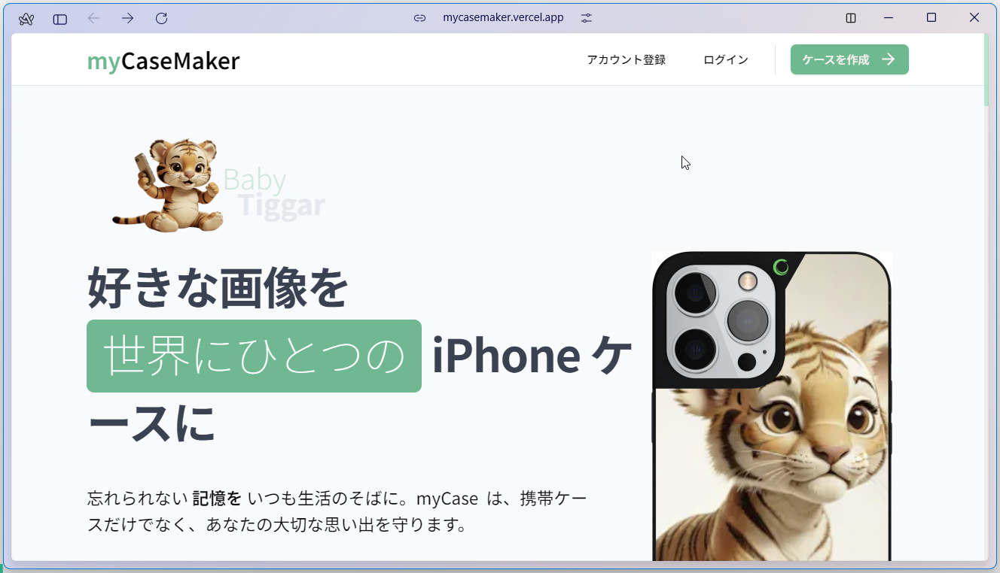
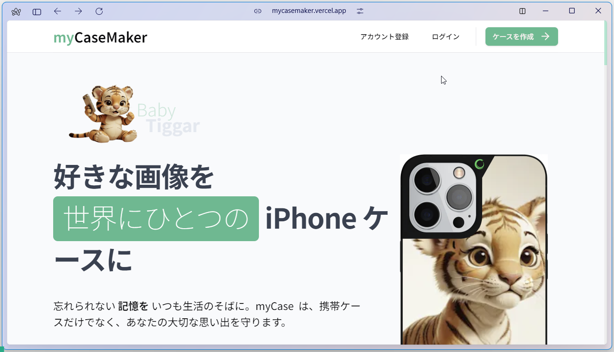
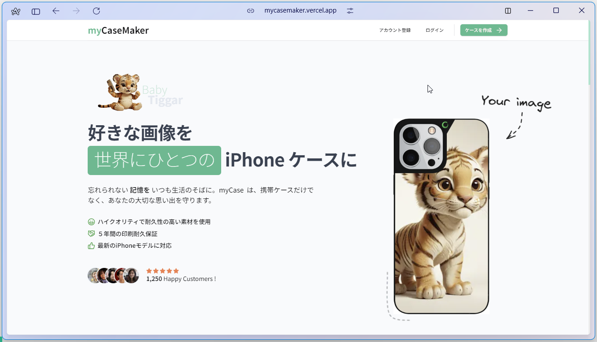
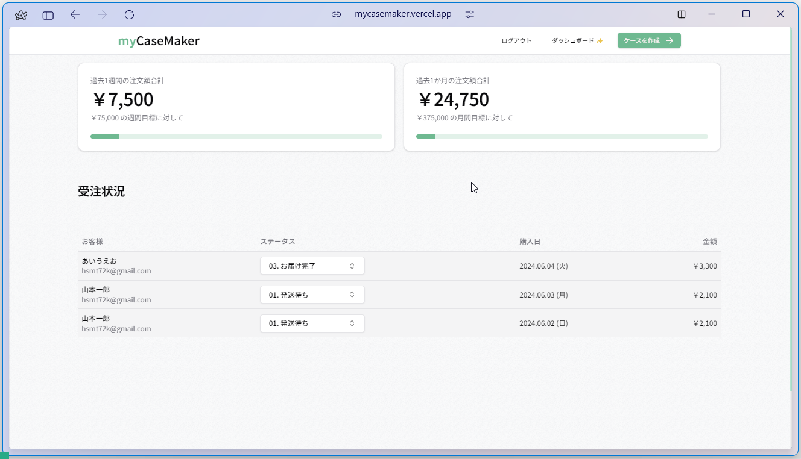

  

    
    
    
    
    
    
    
    
    
    
    
    
    
    
  

  <h3 align="center">A Modern Store for Custom High-Quality Phone Cases</h3>

  

    高品質なオリジナル iPhone ケースを数秒で作成
  

## 📋 <a name="table">Table of Contents</a>

1. 🤖 [はじめに](#intro)
2. 🔗 [URL](#url)
3. 🔋 [アプリの機能](#feature)
4. 🚀 [アプリの利用サンプル](#example)
5. 🤸 [終わりに](#outro)

## <a name="intro">🤖 はじめに</a>

お気に入りの画像をアップロードして、オリジナルの iPhone ケースを作成・注文できるサービス、myCaseMaker のご紹介。

## <a name="url">🔗 URL</a>

myCaseMaker | Make Custom High-Quality Phone Cases in Seconds  
https://mycasemaker.vercel.app

## <a name="feature">🔋 アプリの機能</a>

🛠️ Complete shop built from scratch in Next.js 14

🎨 Custom artworks made by a professional illustrator

### 💻 サービス内容を伝える美しいランディングページ

### 🔑 ユーザ認証システム

メールアドレスまたは Google アカウントによるユーザ認証

### 💳 システム管理者専用ページで注文管理

メールアドレス、または Google アカウントのログインによりユーザ認証を保護

### 🖥️ ドラッグ＆ドロップによるファイルアップロード

### 🛍️ 顧客は貴社から直接購入できる

### 🌟 シンプルでモダンな UX/UI 設計

### 🛒 完全カスタムの携帯ケース設定ツール

### ✉️ 購入後にユーザにお礼メールを自動送信

### ✅ どんなデバイスでも崩れず美しく表示するレスポンシブレイアウト設計

### ⌨️ 100% TypeScript で作られた堅牢で保守性の高いソースコード

🎁 ...much more

## <a name="example">🚀 アプリの利用サンプル</a>

1. [認証機能](#authentication)★★★★★
   1. [アカウント登録](#account-register)★★★★★
   2. [ログイン](#login)★★★★★
      1. [通常ユーザでのログイン](#login-with-normal-account)★★★★★
      2. [管理者アカウントでのログイン](#login-with-admin-account)★★★★★
   3. [ログアウト](#logout)★★★★★
2. [ランディングページ](#landing-page)★★★★★
   1. [ヒーローイメージ](#hero-image)★★★★★
   2. [テスティモニアル（お客様の声）](#testimonials)
   3. [ショーケースアニメーション](#animation-of-showcase)
   4. [カスタマイズイメージ](#image-of-customization)
3. [画像アップロードページ](#uploading-page)
4. [カスタマイジングページ](#design-configurator)
   1. [画像の大きさ調整](#image-size-adjustment)
   2. [画像の位置調整](#image-positioning)
   3. [オプション選択](#select-options)
      1. [色の選択](#color-options)
      2. [iPhone モデルの選択](#model-options)
      3. [素材の選択](#material-options)
      4. [仕上げ加工の選択](#texture-options)
   4. [「続ける」ボタン](#continue-button)
   5. [ログインモーダル](#login-modal)
5. [内容確認ページ](#preview-page)
6. [決済ページ](#payment-page)
7. [Thank you ページ](#thank-you-page)
8. [Thank you メール](#thank-you-mail)
9. [システム管理者専用の注文管理ページ](#dashboard)

### <a name="authentication">1. 認証機能</a>

#### <a name="account-register">1-1. アカウント登録</a>

氏名とメールアドレス、または Google アカウントを使ってアカウント登録することができる。

メールアドレスでアカウント登録した場合は、登録したメールアドレスあてに確認コードがメールで送信される。確認コードを入力して、「続ける」ボタンをクリックすることでアカウント登録が完了する。

#### <a name="login">1-2. ログイン</a>

##### <a name="login-with-normal-account">1-2-1. 通常ユーザでのログイン</a>

アカウント登録したメールアドレス、または Google アカウントを使ってログインすることができる。

ログインする前は、サイトヘッダにあるナビゲーションバーに「アカウント登録」「ログイン」のリンクが表示されていたが、ログインをすると表示されるリンクは「ログアウト」に変わる。

##### <a name="login-with-admin-account">1-2-2. 管理者アカウントでのログイン</a>

管理者アカウントでログインすると、ナビゲーションバーに「ログアウト」リンクのほかに、「ダッシュボード ✨」リンクも表示される。

「ダッシュボード ✨」リンクをクリックすると、システム管理者専用ページに遷移する。

#### <a name="logout">1-3. ログアウト</a>

ヘッダナビゲーションバーの「ログアウト」リンクをクリックすると、ログアウトされる。

ログアウトすると、ランディングページ（入口のページ）に遷移する。

### <a name="landing-page">2. ランディングページ</a>

サイトの入り口として、ルートパス（`https://mycasemaker.vercel.app`）にアクセスすると、ランディングページが表示される。

サイトへの訪問者が最初にアクセスするページのことを通称、ランディングページ（LP）と呼んでいる。訪問者が最初に着地（landing）するページであることから、ランディングページと呼ばれる。

ランディングページには、ログインユーザも、未ログインユーザもアクセスすることができる。

#### <a name="hero-image">2-1. ヒーローイメージ</a>

ヒーローイメージとは、ウェブサイトのトップページの先頭に目立つように表示される、サイズの大きい、特徴的な画像のこと。

サイトのイメージとして、ユーザに強い印象を与えることを目的として、ヒーローイメージを表示させている。

このサイトでは、デバイスサイズが小さい（表示ブラウザの横幅が狭い）場合は、ヒーローイメージがトップのメインメッセージエリアの下に回り込むようにレイアウトが変化する。

#### <a name="testimonials">2-2. テスティモニアル（お客様の声）</a>

ページトップのメインメッセージ、ヒーローイメージの下にユーザの感想（testimonial）を表示している。

自分でオリジナル iPhone ケースを作った感想を目にすることで、商品特性がリアリティを持って伝わるようにしている。

PC のような大きなデバイスでは、テスティモニアルは２つ横並びで表示される。小さなデバイスでは、テスティモニアルが２つ立て並びで表示されるようにレイアウトが変化するようにしている。

#### <a name="animation-of-showcase">2-3. ショーケースアニメーション</a>

ユーザがランディングページを下にスクロールしていくと、トップメインメッセージ、ヒーローイメージ、テスティモニアルに続いて、iPhone ケースのショーケースアニメーションが流れるようになっている。

「アプロードした画像を iPhone ケースにしたらどうなるのか？」

その実例が分かるサンプルが、下から上に自動で流れていくアニメーションで表示される。今回は６０種類あるサンプルから、ランダムで次々に表示されていく。

PC のような大きなデバイスでは、横に3列、iPhone ケースが縦に流れるような形になっている。左右の端の列は少し流れるスピードが速く、中央の列はスピードが緩やか。

小さなデバイスでは、表示される列が２列になるよう、レイアウトが変化する。

#### <a name="image-of-customization">2-4. カスタマイズイメージ</a>

アップロードした画像を iPhone ケースにしたらどうなるか。

ランディングページの最下部には、アップロード画像と iPhone ケースに加工したものを並べて比較しているセクションがある。

左にアップロード画像、右向きの矢印で示す先に iPhone ケースに加工したもの。Before、After が分かるようにしている。

カスタマイズイメージの下には商品特長を４つのリスト（ブレット：bullet）で伝えている。

最後に「ケースを作成」するボタンある。「ケースを作成」ボタンをクリックすると、画像アップロードページに遷移し、iPhone ケースの作成工程に移る。

