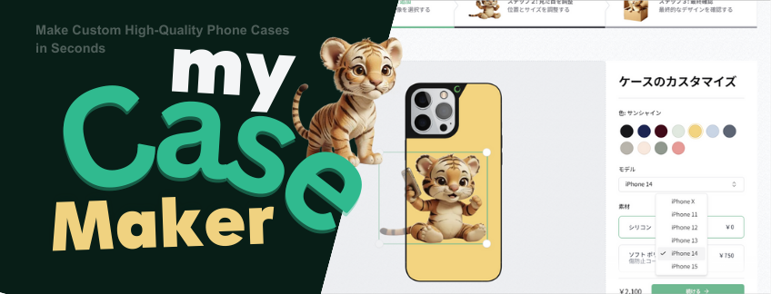

  

    
    
    
    
    
    
        
    
    
    
    
    
    
  

  <h3 align="center">A Modern Store for Custom High-Quality Phone Cases</h3>

  

    高品質なオリジナル iPhone ケースを数秒で作成
  

## 📋 <a name="table">Table of Contents</a>

1. 🤖 [はじめに](#intro)
2. 🔗 [URL](#url)
3. 🔋 [アプリの機能](#feature)
4. 🚀 [アプリの利用サンプル](#example)
5. 🤸 [終わりに](#outro)

## <a name="intro">🤖 はじめに</a>

お気に入りの画像をアップロードして、オリジナルの iPhone ケースを作成・注文できるサービス、myCaseMaker のご紹介。

## <a name="url">🔗 URL</a>

myCaseMaker | 高品質なオリジナル iPhone ケース作成サービス  
https://mycasemaker.vercel.app

## <a name="feature">🔋 アプリの機能</a>

🛠️ ビジネスケースを想定したフルスクラッチのアプリ設計

🎨 サービスを印象づけるためのキャラクターコンセプト

💻 サービス内容を伝える美しいランディングページ

🔑 メールアドレスまたは Google アカウントによるユーザ認証システム

🖥️ ドラッグ＆ドロップによるファイルアップロード

🛒 完全カスタムの iPhone ケース設定ツール

🛍️ Stripe 社のサービスを利用した決済システム

✉️ 購入後にユーザにお礼メールを自動送信

💳 システム管理者専用ページで注文管理

🌟 シンプルでモダンな UX/UI 設計

✅ どんなデバイスでも崩れず美しく表示するレスポンシブレイアウト設計

⌨️ 100% TypeScript で作られた堅牢で保守性の高いソースコード

🎁 ... その他、ユーザフレンドリーな機能が多数

## <a name="example">🚀 アプリの利用サンプル</a>

1. [認証機能](#authentication)
   1. [アカウント登録](#account-register)
   2. [ログイン](#login)
      1. [通常ユーザでのログイン](#login-with-normal-account)
      2. [管理者アカウントでのログイン](#login-with-admin-account)
   3. [ログアウト](#logout)
2. [ランディングページ](#landing-page)
   1. [ヒーローイメージ](#hero-image)
   2. [テスティモニアル（お客様の声）](#testimonials)
   3. [ショーケースアニメーション](#animation-of-showcase)
   4. [カスタマイズイメージ](#image-of-customization)
3. [画像アップロードページ](#uploading-page)
4. [カスタマイジングページ](#design-configurator)
   1. [画像の大きさ調整](#image-size-adjustment)
   2. [画像の位置調整](#image-positioning)
   3. [オプション選択](#select-options)
      1. [色の選択](#color-options)
      2. [iPhone モデルの選択](#model-options)
      3. [素材の選択](#material-options)
      4. [仕上げ加工の選択](#texture-options)
   4. [「続ける」ボタン](#continue-button)
5. [内容確認ページ](#preview-page)
   1. [「注文する」ボタン](#continue-button)
      1. [ログインしていない場合](#not-logged-in)
      2. [ログインしている場合](#already-logged-in)
   2. [ログインモーダル](#login-modal)
6. [決済ページ](#payment-page)
7. [Thank you ページ](#thank-you-page)
8. [Thank you メール](#thank-you-mail)
9. [システム管理者専用の注文管理ページ](#dashboard)

### <a name="authentication">1. 認証機能</a>

#### <a name="account-register">1-1. アカウント登録</a>

氏名とメールアドレス、または Google アカウントを使ってアカウント登録することができる。

メールアドレスでアカウント登録した場合は、登録したメールアドレスあてに確認コードがメールで送信される。確認コードを入力して、「続ける」ボタンをクリックすることでアカウント登録が完了する。

#### <a name="login">1-2. ログイン</a>

##### <a name="login-with-normal-account">1-2-1. 通常ユーザでのログイン</a>

アカウント登録したメールアドレス、または Google アカウントを使ってログインすることができる。

ログインする前は、サイトヘッダにあるナビゲーションバーに「アカウント登録」「ログイン」のリンクが表示されていたが、ログインをすると表示されるリンクは「ログアウト」に変わる。

##### <a name="login-with-admin-account">1-2-2. 管理者アカウントでのログイン</a>

管理者アカウントでログインすると、ナビゲーションバーに「ログアウト」リンクのほかに、「ダッシュボード ✨」リンクも表示される。

「ダッシュボード ✨」リンクをクリックすると、システム管理者専用ページに遷移する。

#### <a name="logout">1-3. ログアウト</a>

ヘッダナビゲーションバーの「ログアウト」リンクをクリックすると、ログアウトされる。

ログアウトすると、ランディングページ（入口のページ）に遷移する。

### <a name="landing-page">2. ランディングページ</a>

サイトの入り口として、ルートパス（`https://mycasemaker.vercel.app`）にアクセスすると、ランディングページが表示される。

サイトへの訪問者が最初にアクセスするページのことを通称、ランディングページ（LP）と呼んでいる。訪問者が最初に着地（landing）するページであることから、ランディングページと呼ばれる。

ランディングページには、ログインユーザも、未ログインユーザもアクセスすることができる。

#### <a name="hero-image">2-1. ヒーローイメージ</a>

ヒーローイメージとは、ウェブサイトのトップページの先頭に目立つように表示される、サイズの大きい、特徴的な画像のこと。

サイトのイメージとして、ユーザに強い印象を与えることを目的として、ヒーローイメージを表示させている。

このサイトでは、デバイスサイズが小さい（表示ブラウザの横幅が狭い）場合は、ヒーローイメージがトップのメインメッセージエリアの下に回り込むようにレイアウトが変化する。

#### <a name="testimonials">2-2. テスティモニアル（お客様の声）</a>

ページトップのメインメッセージ、ヒーローイメージの下にユーザの感想（testimonial）を表示している。

自分でオリジナル iPhone ケースを作った感想を目にすることで、商品特性がリアリティを持って伝わるようにしている。

PC のような大きなデバイスでは、テスティモニアルは２つ横並びで表示される。小さなデバイスでは、テスティモニアルが２つ立て並びで表示されるようにレイアウトが変化するようにしている。

#### <a name="animation-of-showcase">2-3. ショーケースアニメーション</a>

ユーザがランディングページを下にスクロールしていくと、トップメインメッセージ、ヒーローイメージ、テスティモニアルに続いて、iPhone ケースのショーケースアニメーションが流れるようになっている。

「アプロードした画像を iPhone ケースにしたらどうなるのか？」

その実例が分かるサンプルが、下から上に自動で流れていくアニメーションで表示される。今回は６０種類あるサンプルから、ランダムで次々に表示されていく。

PC のような大きなデバイスでは、横に 3 列、iPhone ケースが縦に流れるような形になっている。左右の端の列は少し流れるスピードが速く、中央の列はスピードが緩やか。

小さなデバイスでは、表示される列が２列になるよう、レイアウトが変化する。

#### <a name="image-of-customization">2-4. カスタマイズイメージ</a>

アップロードした画像を iPhone ケースにしたらどうなるか。

ランディングページの最下部には、アップロード画像と iPhone ケースに加工したものを並べて比較しているセクションがある。

左にアップロード画像、右向きの矢印で示す先に iPhone ケースに加工したもの。Before、After が分かるようにしている。

カスタマイズイメージの下には商品特長を４つのリスト（ブレット：bullet）で伝えている。

最後に「ケースを作成」するボタンある。「ケースを作成」ボタンをクリックすると、画像アップロードページに遷移し、iPhone ケースの作成工程に移る。

### <a name="uploading-page">3. 画像アップロードページ</a>

iPhone ケースにしたい画像をアップロードする画面。

画像アップロードページにたどり着く入口は以下の２つのルートがある。

- ヘッダナビゲーションバーの「ケースを作成」ボタン
- ランディングページ最下部の「ケースを作成」ボタン

ページ上部には、iPhone ケースの作成で行う３ステップで横並びのフローで表示されている。まず現在は、「ステップ１：画像追加」のステップであることを示している。

小さなデバイスでは、３ステップのフロー表示が横並びではなく、立て並びに変化する。

画像アップロードエリアが画面中央にはある。エリアをクリックすることで、フォルダからファイル選択してアップロードすることができる。

また、画像アップロードエリアに直接、画像ファイルをドラッグ＆ドロップして、画像のアップロードも可能。

画像アップロードエリアに表示されている通り、PNG、JPG、JPEG 以外の形式のファイルをアップロードしようとすると、エラーメッセージが画面下部にスライドインして表示される（トースト表示）。

### <a name="design-configurator">4. カスタマイジングページ</a>

画像のアップロードが完了すると、ケースのカスタマイジングページに自動的に移動する。

カスタマイジングページの構成は、左側にビジュアルエディタ、右側にオプション選択エリアになっている。

小さなデバイスでは、エリアの表示が横並びではなく、立て並びに変化する。

#### <a name="image-size-adjustment">4-1. 画像の大きさ調整</a>

アップロードした画像は、サイズを調整することができる。

カスタマイジングページでは、画像には外枠が表示された状態になっている。この外枠の四隅はクリック可能な丸いハンドルになっている。

ハンドルをマウスまたはタップでドラッグし、ドラッグ箇所を移動させることで画像の縮小、拡大が可能となる。

#### <a name="image-positioning">4-2. 画像の位置調整</a>

アップロードした画像は、位置を調整することができる。

画像をマウスでホバーする（画像の上にマウスカーソルを重ねる）と、マウスカーソルが矢印が十字になった形に変化する。

十字カーソルになった状態で画像をドラッグしたまま、マウスを移動させると移動させた位置に画像を持っていくことができる。

#### <a name="select-options">4-3. オプション選択</a>

作成する iPhone ケースのビジュアルエディタの右隣に、ケースのオプション選択エリアがある。 小さなデバイスでは、ビジュアルエディタとオプション選択エリアは、立て並びになるように、レイアウトが変化する。

また、各オプションは、選択肢を増やすことが簡単にできるようになっている。

##### <a name="color-options">4-3-1. 色の選択</a>

カラーパレットから、好みの色を選択することで、iPhone ケースの色を変更することができる。

このカラーパレットで色を変更する UX/UI（使用感/部品）は、Apple 公式サイトの iPhone ケースの販売ページにインスパイアされている。

##### <a name="model-options">4-3-2. iPhone モデルの選択</a>

セレクトボックスを使って、ケースに合わせる iPhone モデルを選択することができる。

##### <a name="material-options">4-3-3. 素材の選択</a>

ケースの素材を、並んでいる選択肢の中から１つ選ぶようになっている。選んだ選択肢に設定されている価格により、表示されているケースの合計金額が変化する。

##### <a name="texture-options">4-3-4. 仕上げ加工の選択</a>

ケースの仕上げ加工をどうするかについても、並んでいる選択肢の中から１つ選ぶようになっている。現状は２択になっているが、選択肢は簡単に増やせるようになっている。

#### <a name="continue-button">4-4. 「続ける」ボタン</a>

「続ける」ボタンをクリックすると、ボタンは非活性（ボタンを押せない状態）になり、ボタンの表示が「保存中...」に変化する。

ボタンの表示が「保存中...」になっている間は、ユーザが設定したカスタマイジング内容がデータベースに保存が行われる。

データベースへの設定の保存が完了すると、内容確認ページに自動的に移動する。

### <a name="preview-page">5. 内容確認ページ</a>

内容確認ページの構成は、左側に iPhone ケースの完成イメージ、右側にケースの仕様表示エリアとなっている。

右側にケースの仕様表示エリアには、ケースの仕様、それぞれのオプション価格、合計金額、「注文する」ボタンが表示される。

#### <a name="continue-button">5-1. 「注文する」ボタン</a>

「注文する」ボタンをクリックした時の動作は、ユーザがログインしていない場合と、すでにログインしている場合とで異なる。

##### <a name="not-logged-in">5-1-1. ログインしていない場合</a>

ユーザがログインしていない状態で「注文する」ボタンをクリックすると、ユーザにログインを促す、ログインモーダルが開くようになっている。

##### <a name="already-logged-in">5-1-2. ログインしている場合</a>

ユーザがすでにログインしている状態で「注文する」ボタンをクリックすると、自動的に決済ページに移動する。

#### <a name="login-modal">5-2. ログインモーダル</a>

ログインしていないユーザが「注文する」ボタンをクリックすると、ログインモーダルが開く。

ログインモーダルには、「ログイン」「アカウント登録」の２つのボタンがあり、各ボタンを選択することで、ログイン画面、アカウント登録画面に行くことができる。

ログインが完了すると、ログインした状態で再度、内容確認ページが開く。

### <a name="payment-page">6. 決済ページ</a>

注文内容を確認した上で「注文する」ボタンをクリックすると、決済ページに遷移する。

必要項目として、メールアドレス、氏名、住所を入力する。

現状の決済システムは、テストモードになっているため、実際には決済が行われないダミー決済で処理が進むようになっている。

ダミー決済を進めるためには、カード番号には「42」並びのダミー番号を入力する。「MM(月) / YY（年）」には、未来の月、年を入力する。セキュリティコードには任意の 3 桁の番号を入力する。

すべての項目を入力して、「支払う」ボタンをクリックすると、ダミー決済処理が進む。ダミー決済が完了すると、Thank you ページに移動する。

### <a name="thank-you-page">7. Thank you ページ</a>

決済が完了すると、自動的に Thank you ページに移動し、注文内容の読み込みが始まる。

注文内容の読み込み処理が完了すると、注文したケースの完成イメージが、iPhone ケースを手に握った状態のイメージで表示される。

情報として、注文番号、配送先住所、請求先住所、支払い状況、配送方法、注文金額詳細が表示される。

### <a name="thank-you-mail">8. Thank you メール</a>

決済が完了すると、決済ページで入力したメールアドレス宛てに Thank you メールが送信される。

Thank you メールには、注文ありがとうのメッセージとともに、お届け先住所、注文番号、注文日の情報が記載されている。

### <a name="dashboard">9. システム管理者専用の注文管理ページ</a>

システム管理者用のメールアドレスでログインしている場合のみ、ヘッダナビゲーションバーに「ダッシュボード」リンクが表示される。

この「ダッシュボード」リンクをクリックすると、システム管理者専用の注文管理ページを開くことができる。

ページには、過去１週間に受けた注文合計金額が表示され、週の目標金額に対してどれだけの売り上げ達成をしているかが表示される。同じく、過去１か月間の状況についての情報も表示される。

売り上げ情報の下には、受注状況一覧が表示される。受注状況一覧には、各注文の氏名、注文ステータス、購入日、購入金額が表示される。

注文に対して発送が済んだり、配送が完了した時点で注文ステータスを変更することができる。

## <a name="outro">🤸 おわりに</a>

このオリジナル iPhone ケース作成サービスには、他にも機能を拡充させる余地はいろいろとある。

しかしながら、サービスを運用を開始するために必要な必要最低限の機能はひと通り備えている。メンテナンス、機能追加が容易なアプリ設計になっているため、サービスを開始してからから、必要に応じて機能追加していくことも十分に可能となっている。
